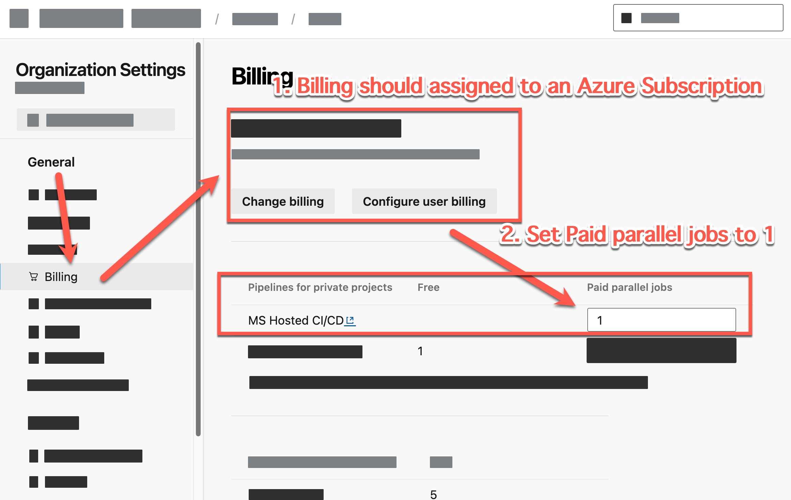
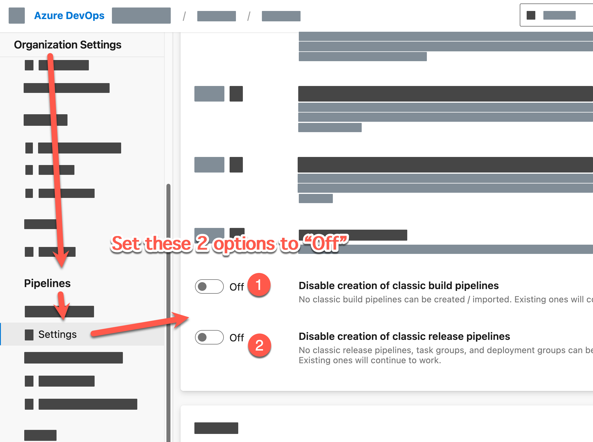
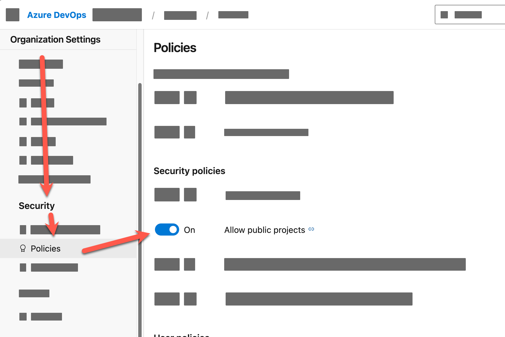

# แนวทางการเตรียมการฝึกอบรม

## 1. โปรแกรมที่ต้องติดตั้ง

เครื่องของผู้เรียนแต่ละคนต้องติดตั้งโปรแกรมต่อไปนี้:

1. Microsoft Edge  
2. File Explorer | Finder (MacOS)  
3. Terminal (Command Prompt หรือ PowerShell)  
4. [Visual Studio](https://visualstudio.microsoft.com/) หรือ [Visual Studio Code](https://code.visualstudio.com/)  
5. [.NET 6 SDK](https://dotnet.microsoft.com/en-us/download/dotnet/6.0)  
6. Azure CLI ([ดาวน์โหลดสำหรับ Windows](https://learn.microsoft.com/en-us/cli/azure/install-azure-cli-windows?tabs=azure-cli#install-or-update) | [ติดตั้งสำหรับ MacOS (ผ่าน Homebrew)](https://learn.microsoft.com/en-us/cli/azure/install-azure-cli-macos))  
7. Git Client ([ดาวน์โหลดสำหรับ Windows](https://git-scm.com/download/win) | [ติดตั้งสำหรับ MacOS](https://git-scm.com/download/mac))  

    หากนี่เป็นครั้งแรกที่คุณติดตั้ง Git บนเครื่องของคุณ ให้รันคำสั่งต่อไปนี้:  
    **(แทนที่ "Your Name" และ "Your email" ด้วยชื่อและอีเมลของคุณ)**  

    ```bash
    git config --global user.name "Your Name"
    git config --global user.email "Your email"
    ```

## 2. การตั้งค่า Proxy และ Firewall

- กรุณาตรวจสอบให้แน่ใจว่าเครื่องของคุณไม่มีการตั้งค่า Proxy หรือ Firewall ที่บล็อก URL หรือสิทธิ์การเข้าถึงไฟล์ที่ใช้ในเวิร์กชอป

## 3. ข้อกำหนดการตั้งค่าบัญชี (จัดเตรียมโดยผู้ดูแล Lab)

1. บัญชี Azure DevOps  
   - ต้องมีสิทธิ์เต็มในการสร้างโปรเจกต์, รีโพสิทอรี, ไปป์ไลน์ ฯลฯ  
   - ต้องมีองค์กรที่ตั้งค่าไว้ตามเงื่อนไขต่อไปนี้:

     1. **การตั้งค่าองค์กร > การเรียกเก็บเงิน (Billing)**: ตั้งค่าการเรียกเก็บเงินด้วย Azure Subscription  

        

     2. **การตั้งค่าองค์กร > ไปป์ไลน์ > การตั้งค่า (Pipeline > Settings)**: ปิดการสร้าง Classic Build Pipeline และ Classic Release Pipeline  

        

     3. **การตั้งค่าองค์กร > ความปลอดภัย > นโยบาย (Security > Policies)**: เปิดการตั้งค่า "Allow public projects"  

        

2. บัญชี Azure Portal พร้อม Subscription  
   - ต้องมีสิทธิ์เต็มในการสร้างทรัพยากรและบริการต่างๆ  
   - ตรวจสอบให้แน่ใจว่า Azure Subscription พร้อมใช้งานสำหรับการลงทะเบียนทรัพยากรที่จำเป็น


<!-- ## Ensure your Azure subscription ready register and able to use follow Azure resources (Prepared by Lab host): 

1. Resource group
2. Azure App service
3. Azure Application Insight -->
